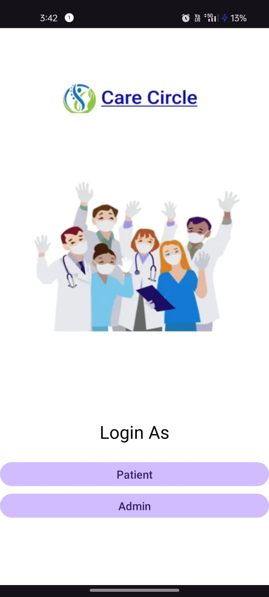
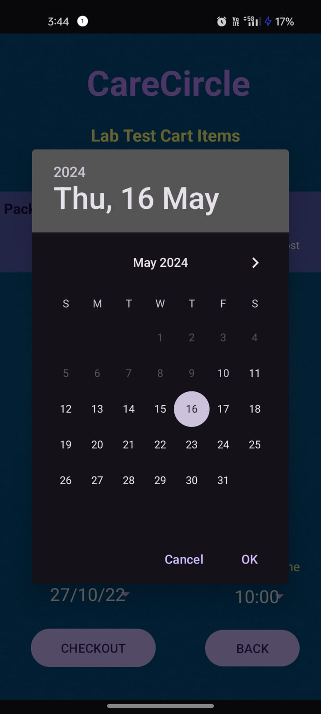
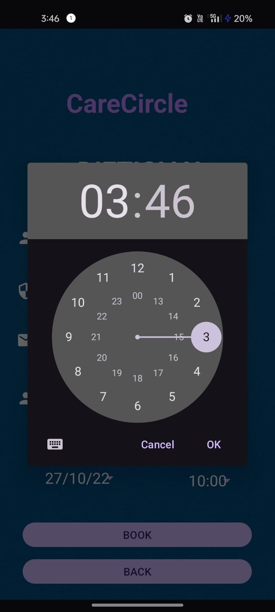

# Healthcare CareCircle

A mobile app that facilitates making appointments and buying medicines, booking lab appointments and allows the admin to approve the appointments.

  

    
  

  

    
  

  

    
  

  

    
  

  

    
  

  

    
  

  

    
  

  

    
  

  

    
  

  

    
  

  

    
  

  

    
  

  

    
  

  

    
  

  

    
  

  

    
  

  

    
  

  

    
  

  

    
  

  

    
  

  

    
  

  

    
  

  

<!-- # healthcare-CareCircle
A mobile app that facilitates making appointments and buying medicines, booking lab appointments and allows the admin to approve the appointments

This is the first page

Continue as user

 -->

